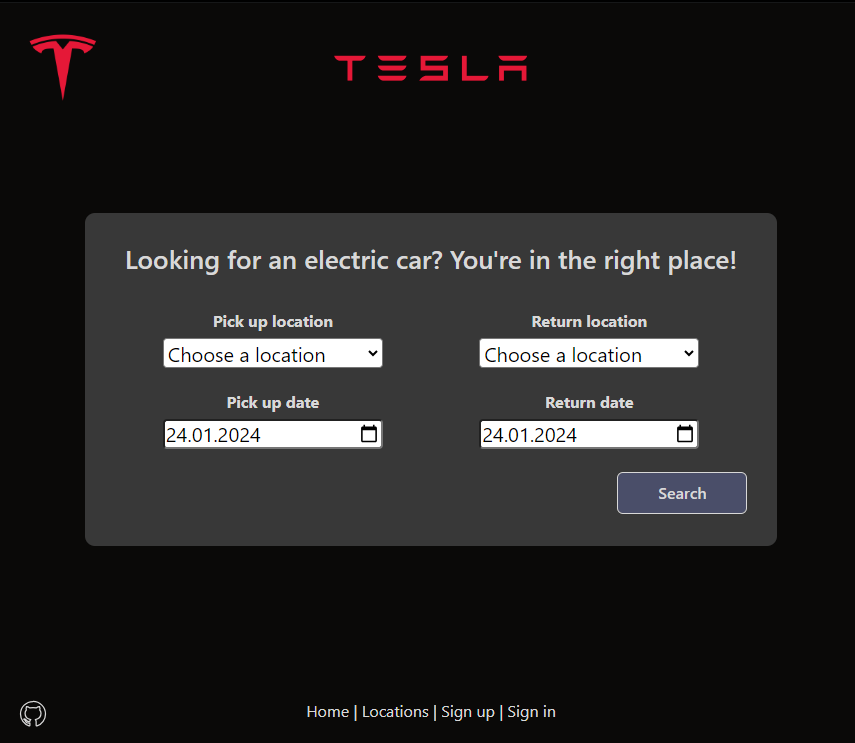
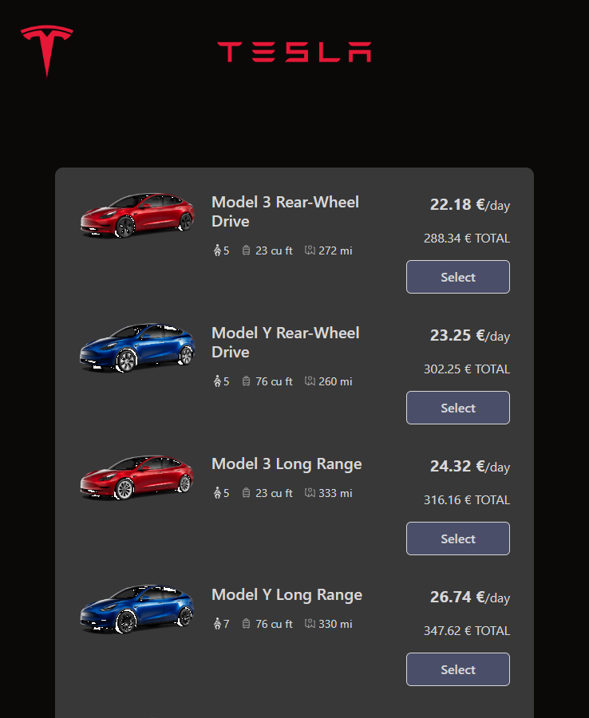
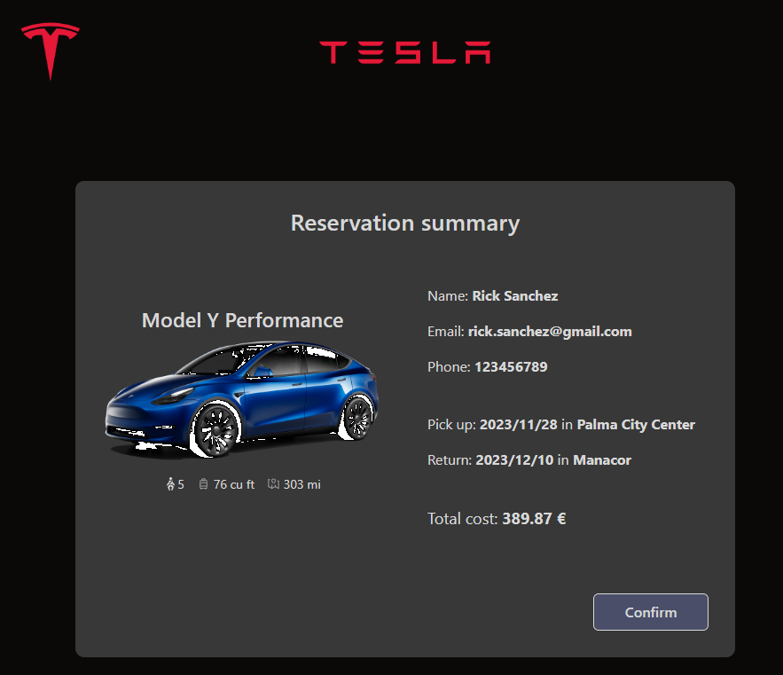
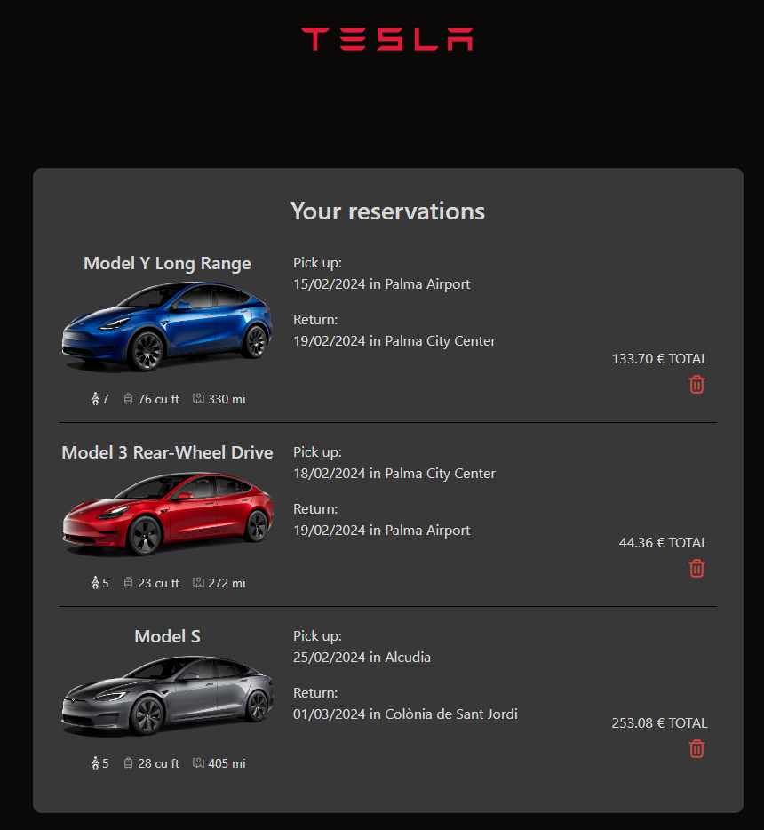
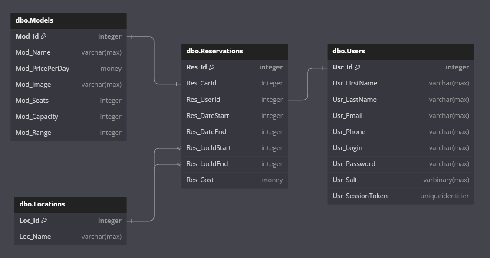

 # Tesla Renting App
> Simple car renting web application.

## Table of Contents
* [General information](#general-information)
* [Technologies used](#technologies-used)
* [Screenshots](#screenshots)
* [Setup](#setup)
* [Database schema](#database-schema)


## General information
This is a car renting web application that simplifies the process of reserving a Tesla car. With this app, users can choose their pick-up and return dates, pick-up and return locations (which can be the same or different) and browse from a range of 10 Tesla car models.\
The app calculates the cost of the rental and saves the reservation in the database.\


## Features
- booking a car without an account
- creating an account
- signing in and booking a car with an account
- editing user's data and password
- displaying and deleting user's reservations
- browsing rental company's locations


## Technologies used
- ASP.NET
- React.js
- MS SQL


## Screenshots






## Setup

### Prerequisites

In order to run this app locally you will need:
* Visual Studio
* .NET 6 or higher
* SQL Server
* Node.js


### Installation

1. Clone the repository to your local machine\
`git clone https://github.com/arekjg/TeslaRentingApp.git`

2. Go to directory with the application and open `appsetting.json` file. In `ConnectionString > DefaultConnection` in place of `<<SERVER>>` enter name of your SQL Server.

```c
  "ConnectionStrings": {
    "DefaultConnection": "Data Source=<<SERVER>>;Initial Catalog=TeslaRentingDB;Integrated Security=True;Connect Timeout=30;Encrypt=False"
  },
```

3. Open solution file (`TeslaRentingApp.sln`) in Visual Studio.

4. In Package Manager Console run command `update-database`. It will create a database on your server along with all the necessary tables and data.

5. In Visual Studio hit F5 (Start Debugging) or Ctrl + F5 (Start Without Debugging).

If you have Node.js, it will automatically install npm and all necessary node modules.\
The app will start at `https://localhost:7292/` and then redirect to `https://localhost:44401/`.


## Database schema

TeslaRentingDB consists of 4 tables:
* dbo.Models - stores models data like name, price and car's details
* dbo.Locations - stores names of available locations
* dbo.Users - stores drivers' details like name, email, phone number, hashed password, token for opened session
* dbo.Reservations - stores reservations details like pick up and return dates and locations, related model and user, overall renting cost

Database diagram:

