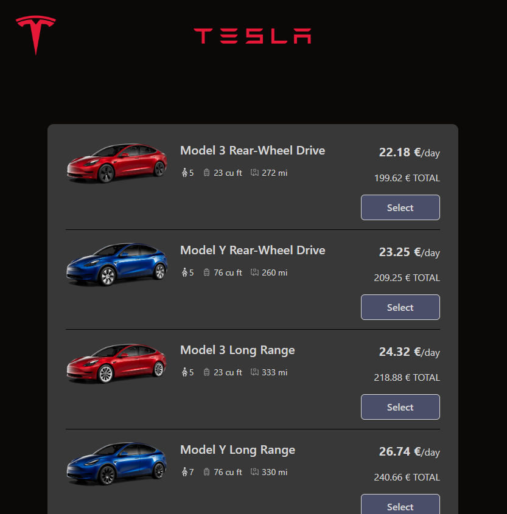
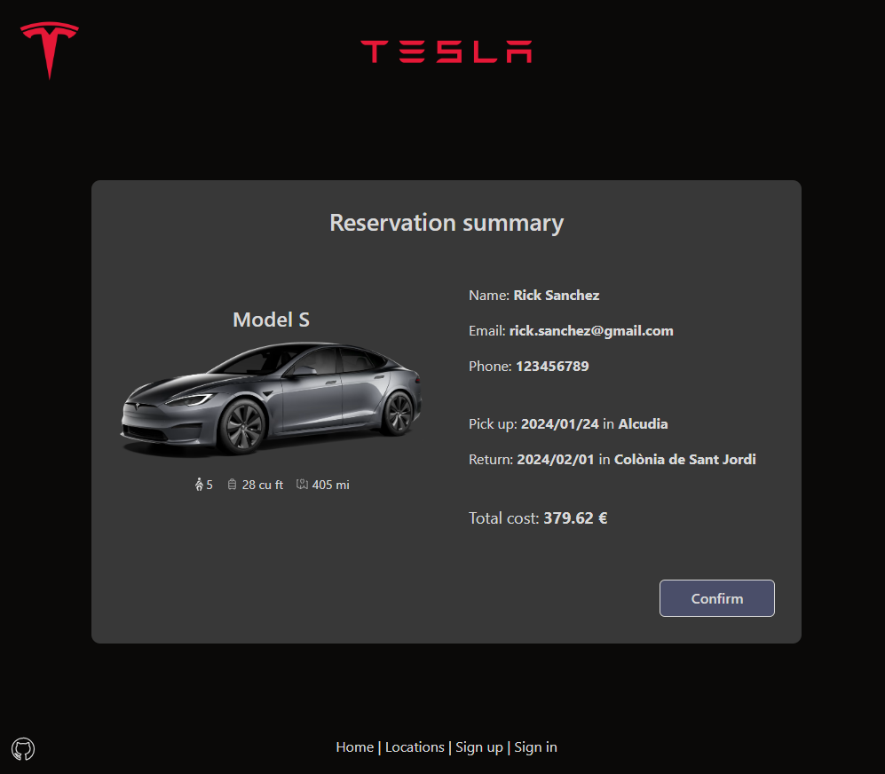

# Tesla Renting App
> Simple car renting web application.

## Table of Contents
* [General information](#general-information)
* [Technologies used](#technologies-used)
* [Screenshots](#screenshots)
* [Setup](#setup)
* [Database schema](#database-schema)


## General information
This is a car renting web application that simplifies the process of reserbing a Tesla car. With this app, users can choose their pick-up and return dates, pick-up and return locations (which can be the same or different) and browse from a range of 10 Tesla car models.

Available locations:
* Palma Airport
* Palma City
* Alcudia
* Manacor

Available models:
* Model 3 Long
* Model 3 Performance
* Model 3 Rear
* Model S
* Model S Plaid
* Model X
* Model X Plaid
* Model Y Long
* Model Y Performance
* Model Y Rear


## Technologies used
- ASP.NET
- React.js
- MS SQL


## Screenshots





## Setup

### Prerequisites

In order to run this app locally you will need:
* Visual Studio
* SQL Server with SQL Server Management Studio
* Node.js


### Installation

1. Clone the repository to your local machine\
`git clone https://github.com/arekjg/TeslaRentingApp.git`

2. Open SQL Server Management Studio and create a database called `TeslaRentingDB`

3. In SSMS open file `setup.sql` from `sql-scripts` directory, then run the scripts. It will create necessary tables and fill them with data.

4. Go to directory with the application and open `appsetting.json` file. In `ConnectionString > DefaultConnection` in place of `<<SERVER>>` enter name of the server on which TeslaRentingDB is running.

```c
  "ConnectionStrings": {
    "DefaultConnection": "Data Source=<<SERVER>>;Initial Catalog=TeslaRentingDB;Integrated Security=True;Connect Timeout=30;Encrypt=False"
  },
```

5. Open solution file (`TeslaRentingApp.sln`) in Visual Studio and hit F5. If you have Node.js, it will automatically install npm and all necessary node modules.\
The app will start at `https://localhost:7292/` and then redirect to `https://localhost:44401/`.


## Database schema

TeslaRentingDB consists of 4 tables:
* dbo.Models - stores models data like name, price and car's details
* dbo.Locations - stores names of available locations
* dbo.Users - stores drivers' details like name, email, phone number
* dbo.Reservations - stores reservations details like pick up and return dates and locations, related model and user, overall renting cost

Database diagram:

